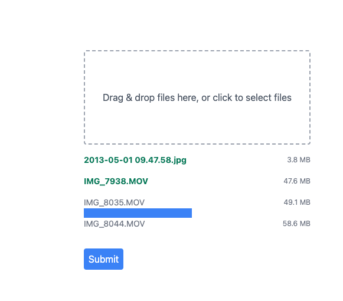

# File Upload with Progress

## End Result



## How to Use?

```js
function App() {
    return (
        <FileUploader url='http://localhost:8080/upload'/>
    );
}
```

## How Does it Work?

Most business logic are in [FileUploaderProvider](src/FileUploader/FileUploaderProvider.tsx), which tracks
state of what files are staged for upload, what files have been uploaded. [FileUploaderProvider](src/FileUploader/FileUploaderProvider.tsx) also
contains functions to turn each `File` into `FormData` and invoke a server URL to POST the `FormData` to.

Server-side code can be found [here](https://github.com/erfangc/upload-with-progress-server).

[FileUploaderProvider](src/FileUploader/FileUploaderProvider.tsx) exposes its state through the [useFileUploaderContext](src/FileUploader/hooks/useFileUploaderContext.ts)
hook. Descendant components uses this hook to obtain read-only upload states and render upload progress with animations.